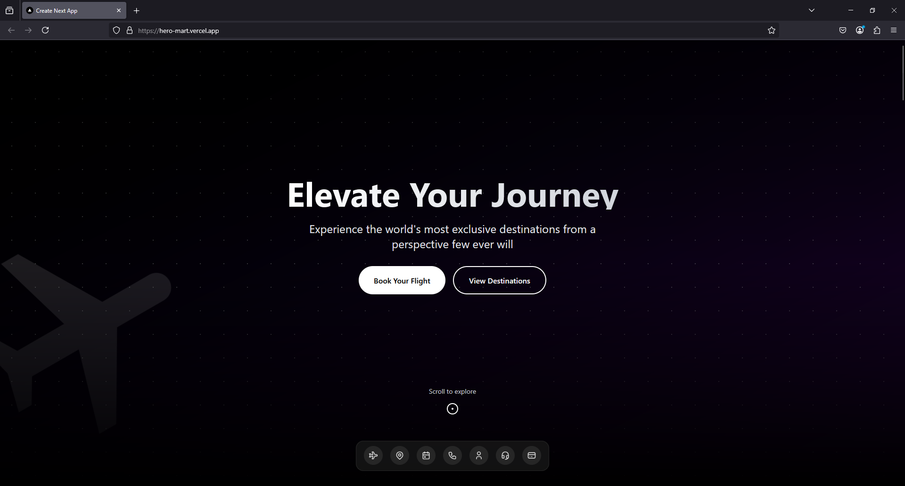
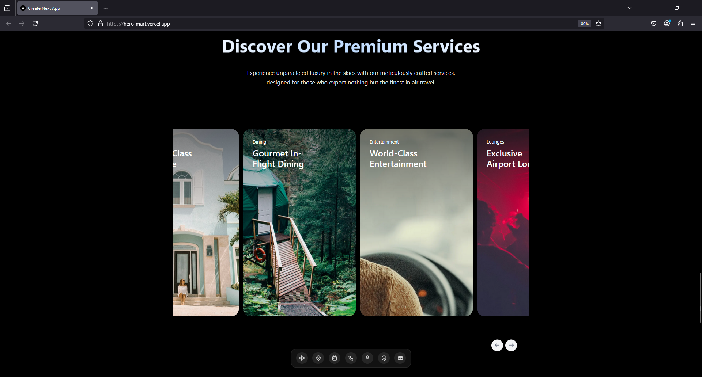

# Flight Company Landing Page

This project was created as part of a hackathon to showcase a modern and responsive landing page for a flight company.

## 🚀 Overview

This is a landing page prototype that showcases:
- Modern and clean design
- Responsive layout
- Interactive UI elements
- Flight booking concept presentation

## 📸 Screenshots


*Homepage hero section*


*Upcoming flights section with globe*


*Services section*

## 🛠️ Technologies Used

- Next.js
- React
- Tailwind CSS
- TypeScript

## 🏃‍♂️ Getting Started

1. Clone the repository:
```bash
git clone https://github.com/100QNKolev/FlightCompanyLandingPage
```

2. Install dependencies:
```bash
npm install
# or
yarn install
```

3. Run the development server:
```bash
npm run dev
# or
yarn dev
```

4. Open [http://localhost:3000](http://localhost:3000) with your browser to see the result.

## ⚠️ Note

This is a prototype landing page created for demonstration purposes during a hackathon. It is not connected to any backend services and does not process real flight bookings.

## 📝 License

This project is open source and available under the [MIT License](LICENSE).

## 🤝 Contributing

While this was created as a hackathon project, suggestions and feedback are welcome! Feel free to open an issue or submit a pull request. 